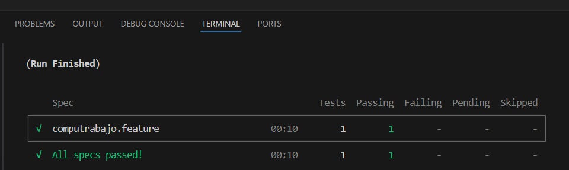
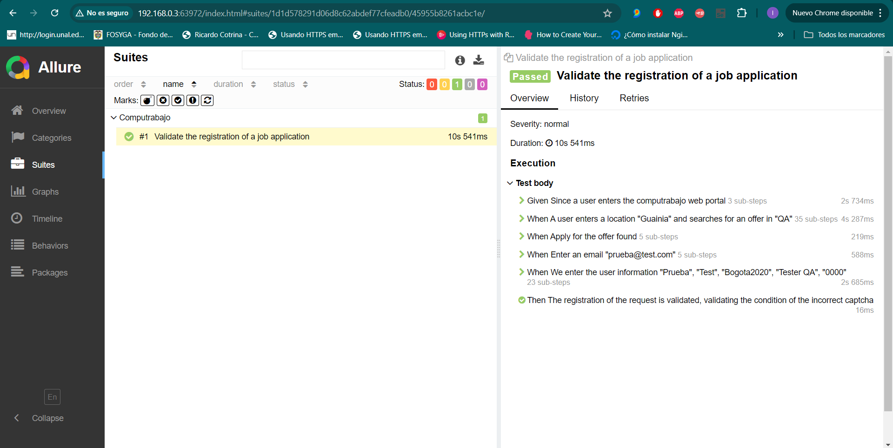

# cypress-automation-computrabajo-e2e-testing

- ## Informacion General

Este repositorio contiene un flujo de pruebas automatizadas desarrolladas en Cypress para el portal de Computrabajo. El objetivo principal del proyecto es validar el flujo de solicitud para aplicar a una oferta de trabajo específica en dicho portal.

Escenario Validado

El escenario principal validado consiste en realizar una solicitud para aplicar a una oferta de trabajo en Computrabajo. Se verifica el flujo completo de la solicitud, desde la seleccion del pais hasta la confirmación del registro del usuario.

Implementación del Modelo POM

Para asegurar un código mantenible y escalable, se ha implementado el Patrón de Objetos de Página (Page Object Model, POM). Esto permite encapsular los elementos de la interfaz de usuario y las acciones en métodos reutilizables, facilitando la modificación y expansión de las pruebas.

## 🚀 Instalación y configuración

Para comenzar a utilizar este marco, siga estos pasos:

1. Instale Cypress
npm install cypress --save-dev

2. Instale todas las dependencias con: npm i

3. Ejecute el comando desde la raiz del proyecto: npm run cypress:execution

4. Se genero el reporte con la herramienta de Allure, permite generar informes detallados del estado de las pruebas: 
   1. npm run cypress:execution-allure
   2. npm run allure:report
   3. allure serve

##  Estructura del código

El marco de automatización en Cypress sigue un enfoque estructurado para lograr una mejor capacidad de mantenimiento y escalabilidad. A continuación, se incluye una descripción general de la estructura del código:

Estructura de carpetas

cypress.config.js: Contiene la URL base y la configuracion principal.

support: contiene archivos de utilidad, que proporciona funciones para interacciones comunes. Tambien gestiona la base principal y objetos a utilizar

allure-results: almacena los informes de pruebas y las capturas de pantalla generadas durante la ejecución de las pruebas.

cypress/e2e/pages: Contiene las definiciones de clases de página para diferentes páginas web, como tambien sus metodos, lo que facilita la interacción con los elementos web.

cypress/e2e/step_definitions: Contiene la definicion de pasos que se deben seguir para ser interpretados con los pasos en lenguaje Gherkin.

cypress/e2e/features: Contiene los archivos donde se definen las caracteristicas de los escenarios de pruebas escritos en lenguaje Gherkin.

cypress/e2e/fixture: Contiene los datos de prueba en formato JSON se almacenan aquí.

## Resultados:

Reporte de Allure

Video

<video controls src="computrabajo.feature.mp4" title="Title"></video>

